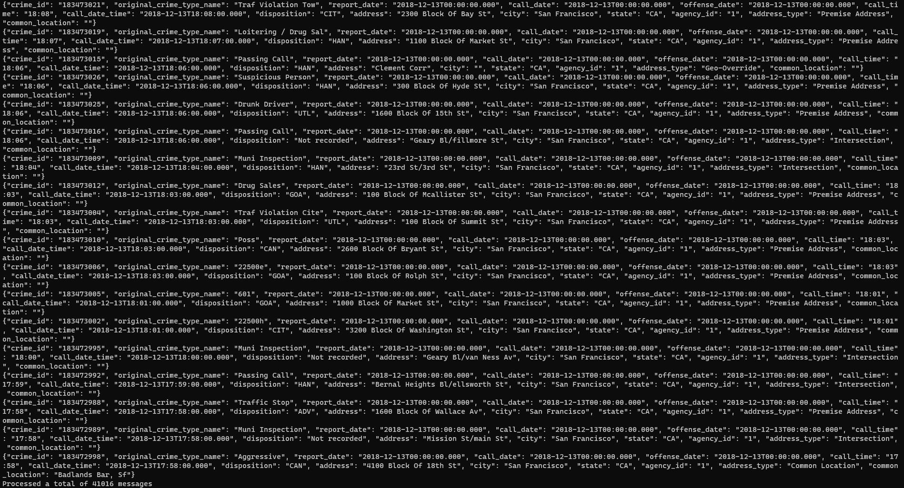
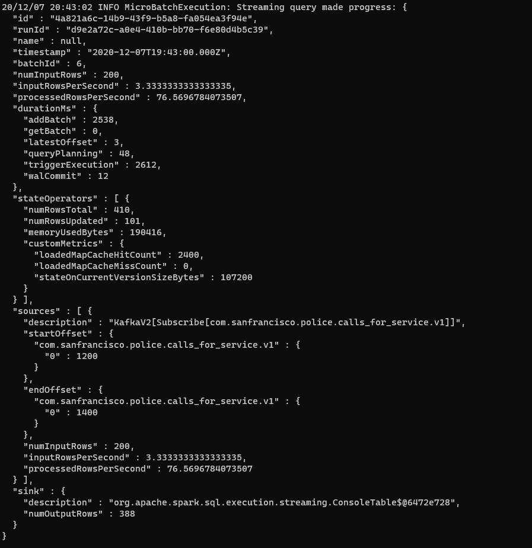
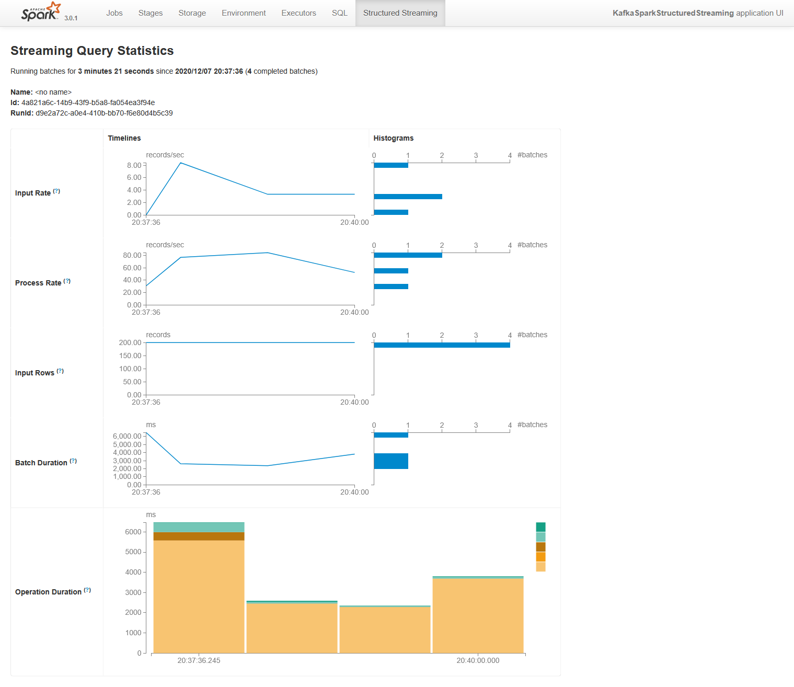

# San Francisco crime statistics with Spark Streaming
In this project, we analyze a real-world dataset of SF Crime Rate, extracted from Kaggle, to provide statistical analysis using Apache Spark Structured Streaming.

## Prerequisites
Before proceeding, it's necessary to install the next software:
* Scala 2.11
* Java 1.8 (openJDK 8)
* Kafka build with Scala 2.11
* Python 3.6 or 3.7  
* Spark 2.4.7 (or Spark 3.0.1 with Scala 2.12 if you need Structured Streaming Tab in WebUI)

## Step to test the software
As initial step, it's mandatory to run Zookeeper and Kafka.

0. Put the dataset inside the folder:
```bash
cp police-department-calls-for-service.json /path/to/code
cp radio_code.json /path/to/code
```

1. Install the python packages:
```bash
pip3 install -r requirements.txt
```

2. Populate Kafka topic:
```bash
python3 kafka_server.py
```

3. Launch the consumer to check the topic is working:
```bash
python3 consumer_server.py # Press Ctrl + C to break
```

4. Launch the data streaming app:
```bash
# For Spark 2.4.7
spark-submit --packages org.apache.spark:spark-sql-kafka-0-10_2.11:2.4.7 --master local[*] data_stream.py
# For Spark 3.0.1
spark-submit --packages org.apache.spark:spark-sql-kafka-0-10_2.12:3.0.1 --master local[*] data_stream.py
```

## Some screenshots
This image shows the output of kafka-console-consumer.sh 


This image shows the progress reporter after executing a Spark job


This image shows the Structured Streaming in the WebUI



## Some questions

### How did changing values on the SparkSession property parameters affect the throughput and latency of the data?

In this context, there are two main groups of options that influence the throughput and latency:
   
* The option values of Kafka streaming.
* The option values of Spark Cluster.

The first group influences how Spark Cluster manages the stream.
The second defines how many resources give to a specific executor.
The relevant options are the following setting:

* spark.streaming.kafka.maxRatePerPartition:  It's set the max messages of a partition in the batch.
* spark.streaming.kafka.maxOffsetsPerTrigger: It's set the max messages processed per trigger.
* spark.executor.memory: It's set the memory for the executor of the job.
* spark.executor.cores: It's set the number of cores for the executor of the job.

It's relevant to understand how the values influence the Spark Job.
For Kafka Streaming, if the value is too low, the messages accumulate in Kafka, while the system is in idle status.
On the other side, if the value is too high, it congestions the batches. That means that it exceeds the time request for the trigger.
For Spark Cluster, the resources are shared between the jobs running on the cluster. Thus the values should be balanced.

### What were the 2-3 most efficient SparkSession property key/value pairs? Through testing multiple variations on values, how can you tell these were the most optimal?
Before proceeding to analyze the used values, it's important to describe the initial assumptions.
The test runs on a local machine with Kafka and Spark. The topic used by  Spark job, it  has 2 partitions. The trigger is set to 10 seconds.
The number of processed rows per second is a good metric to benchmark the settings.
The test is focused on these parameters:

* spark.streaming.kafka.maxRatePerPartition with values 100, 5000, 60000 (the max offsets per trigger values divide for number of partitions)
* spark.streaming.kafka.maxOffsetsPerTrigger with values 200, 10000, 120000
* spark.executor.cores with values 2 and 6

The first consideration, it's that spark.executor.cores setting doesn't influence the result. It can be due to the low number of partitions and to the local mode.
The best result is obtained using spark.streaming.kafka.maxRatePerPartition equal to 60000 and spark.streaming.kafka.maxOffsetsPerTrigger equal to 120000. These parameters permit to have about 8000 rows processed for seconds.
The worst result is obtained using spark.streaming.kafka.maxRatePerPartition equal to 100 and spark.streaming.kafka.maxOffsetsPerTrigger equal to 200. These parameters permit to have about 75 rows processed for seconds.